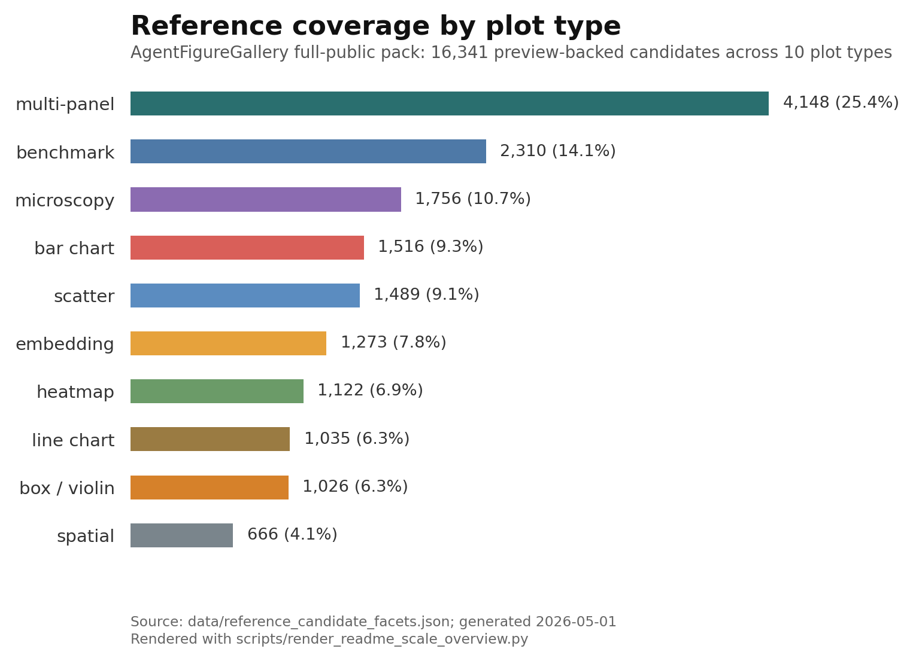

# AgentFigureGallery

[](README.md)
[](README.zh-CN.md)

[](LICENSE)
[](pyproject.toml)
[](docs/REMOTE_FULL_VALIDATION.md)
[](https://huggingface.co/datasets/dsadd4/AgentFigureGallery)

AgentFigureGallery is a scientific plotting reference gallery for Claude Code, Codex, Cursor, and other coding agents.
It lets an agent search real figure references, lets you mark examples as liked, rejected, or selected in a browser gallery, and exports those choices as a reference bundle for plotting code.

**Quick install for Codex:**

```bash
curl -fsSL https://raw.githubusercontent.com/Dsadd4/AgentFigureGallery/main/scripts/install.sh | bash
```

The script clones or updates the repository at `$HOME/AgentFigureGallery`, creates a Python virtual environment, installs the package, and installs the Codex skill wrapper. After this bootstrap install, run the CLI as `~/AgentFigureGallery/.venv/bin/agentfiguregallery`, or activate the environment first:

```bash
source ~/AgentFigureGallery/.venv/bin/activate
```

For an editable manual install, see [Manual Install](#manual-install).


```text
agent query -> browser gallery -> human like/reject/select -> reference bundle -> plotting code
```

Before generating plotting code, the agent queries visual references, the user selects preferred examples in the browser, and AgentFigureGallery exports the selected references for the final plotting task.



## Quick Paths

| Goal | Command or link |
| --- | --- |
| First successful local run after install | `~/AgentFigureGallery/.venv/bin/agentfiguregallery first-run --open` |
| Bootstrap the Codex skill | <code>curl -fsSL https://raw.githubusercontent.com/Dsadd4/AgentFigureGallery/main/scripts/install.sh &#124; bash</code> |
| Install through Awesome Skills | `npx add-skill Dsadd4/AgentFigureGallery` |
| Review install behavior first | [Trust and Install Notes](docs/TRUST_AND_INSTALL.md) |
| Open the Hugging Face showcase | [AgentFigureGallery Space](https://huggingface.co/spaces/dsadd4/AgentFigureGallery) |
| Contribute a reference pack | [Community Packs](docs/COMMUNITY_PACKS.md) |

## Manual Install

```bash
git clone https://github.com/Dsadd4/AgentFigureGallery.git
cd AgentFigureGallery
python -m venv .venv
source .venv/bin/activate
pip install -e .
agentfiguregallery doctor
agentfiguregallery install-skill --target codex
```

The default install is enough for smoke tests and the small built-in reference pack. To use the full 16k+ public reference pool, run the setup command below.

## Full Public Reference Pool

Install the complete `full-public` pack from Hugging Face:

```bash
agentfiguregallery setup --pack full-public --manifest-url https://huggingface.co/datasets/dsadd4/AgentFigureGallery/resolve/main/resource_manifest.json
```

If Hugging Face is blocked, use the GitHub API manifest fallback:

```bash
agentfiguregallery setup --pack full-public --manifest manifests/resource_manifest.github-api.json
```

You can also download the full pack during bootstrap:

```bash
curl -fsSL https://raw.githubusercontent.com/Dsadd4/AgentFigureGallery/main/scripts/install.sh | env AFG_INSTALL_FULL_PUBLIC=1 bash
```

## Browser Gallery Workflow

Create a reference session and open the browser gallery:

```bash
agentfiguregallery gallery --plot-type embedding_plot --limit 50 --serve
# Then open http://127.0.0.1:8765/
```

The command prints a `session` id before starting the local server. In the browser, mark references as liked, rejected, or selected. Those saved preferences are reused by later sessions.

After selecting references, export the bundle for the coding agent:

```bash
agentfiguregallery bundle --session <session_id>
```

The bundle is written to:

```text
outputs/reference_sessions/<session_id>/export_bundle/reference_bundle.json
```

To reopen the frontend later without creating a new reference session:

```bash
agentfiguregallery serve --host 127.0.0.1 --port 8765
```

## Verify Codex Skill

After installing the Codex skill, Codex can discover AgentFigureGallery as a local skill.


Then ask your coding agent to run a plot-type smoke test:

```text
Use AgentFigureGallery to test your installed plotting skill. Generate one Nature-style example for each supported plot type, then export PNG/PDF/SVG and a combined preview.
```

The result should look like this: one Nature-style example for every supported plot type.


See `examples/plot_type_examples/` for the runnable script, source data, and PNG/PDF/SVG outputs.

## For Coding Agents

After `pip install -e .` finishes, tell your Codex, Claude Code, Cursor, or other coding agent:

```text
Read skills/agent-figure-gallery/SKILL.md, then use AgentFigureGallery before writing publication figure code.
```

You can install personal skill wrappers for multiple agents:

```bash
curl -fsSL https://raw.githubusercontent.com/Dsadd4/AgentFigureGallery/main/scripts/install.sh | env AFG_AGENT_TARGETS="codex claude-code cursor" bash
```

Cursor project rules need a project path, so pass it explicitly:

```bash
curl -fsSL https://raw.githubusercontent.com/Dsadd4/AgentFigureGallery/main/scripts/install.sh | env AFG_AGENT_TARGETS="cursor" AFG_CURSOR_PROJECT=/path/to/your-cursor-project bash
```

Or install wrappers manually:

```bash
agentfiguregallery install-skill --target codex
agentfiguregallery install-skill --target claude-code
agentfiguregallery install-skill --target cursor
agentfiguregallery install-cursor-rule --project /path/to/your-cursor-project
```

Codex installs to `~/.codex/skills`, Claude Code installs to `~/.claude/skills`, Cursor-compatible skill installs write to `~/.cursor/skills`, and Cursor project rules write to `.cursor/rules/agent-figure-gallery.mdc`. See `docs/AGENT_QUICKSTART.md` and `examples/agent_prompt.md`.

End-to-end examples:

- `examples/end_to_end_embedding.md`
- `examples/generated_embedding_plot/README.md`
- `examples/before_after_benchmark/README.md`

## Dynamic Gallery

Use the browser gallery to browse candidates by plot type, reject unsuitable references, save plot-type preferences, and export selected examples for the agent. With the `full-public` pack installed, the gallery can draw from 16,341 public visual candidates across common scientific plot types.

```bash
agentfiguregallery query --task "Nature-style embedding map for cell atlas"
agentfiguregallery gallery --plot-type embedding_plot --limit 100 --serve
```

## Extend Your Gallery

AgentFigureGallery can grow after install. You can ask an agent to follow the expansion guide, or add a small local reference pack yourself, then inspect the new candidates in the browser gallery.

Tell your coding agent:

```text
Read ExtendAgent/README.md, then expand AgentFigureGallery for <plot type or style>. Discover high-quality public scientific plotting sources, render every useful reference as a visible preview, preserve stable candidate IDs and source license metadata, rebuild the candidate index, and report candidate counts plus private-path scan results.
```

For manual expansion, the important rules are:

1. Add only references with visible preview PNGs.
2. Preserve stable `candidate_id`, `plot_type`, preview path, source metadata, and license attribution when available.
3. Keep large preview packs, raw upstream repositories, private paths, and tokens out of Git.

See `ExtendAgent/README.md` for the full expansion contract and quality gates.

## Community Packs

Community packs are the public contribution path for reusable plotting references. The base `full-public` pack remains the canonical 16k+ pool maintained by Dsadd4; community contributions land first in `community_pool/`, then accepted material is periodically released as installable asset packs.

Contribution routes:

- Open a Community Pack issue to propose public sources, plot types, or a pack idea.
- Open a PR under `community_pool/packs/<pack_name>/` using the documented schema.
- Keep large assets out of Git; accepted packs are distributed through resource manifests.

After a community release manifest is published, users can selectively install a community pack:

```bash
agentfiguregallery setup --pack community-latest --manifest-url <community_resource_manifest_url>
agentfiguregallery gallery --plot-type embedding_plot --limit 50 --serve
```

See `docs/COMMUNITY_PACKS.md` and `community_pool/README.md` for contribution rules, schemas, review gates, and install patterns.

## What Is Inside

- 16,341 full-public visual candidates across 10 scientific plot types.
- Browser-gallery feedback for personal or lab-specific figure preferences.
- A small curated minimal pack committed for instant smoke tests.
- Codex-equipped plot-type smoke examples with PNG/PDF/SVG outputs.
- Backend CLI, browser gallery, Codex skill wrapper, and agent expansion guide.
- Stable candidate IDs, saved preferences, and export bundles for agent handoff.
- Community pack contribution path for user-submitted plotting references and periodic asset releases.

## Roadmap

- [Curated Cell and Science style reference packs](https://github.com/Dsadd4/AgentFigureGallery/issues/3)
- [Faster full-public mirror for China and restricted networks](https://github.com/Dsadd4/AgentFigureGallery/issues/4)

Completed:

- [One-command Codex skill install](https://github.com/Dsadd4/AgentFigureGallery/issues/1)
- [Generated embedding plot from a reference bundle](examples/generated_embedding_plot/README.md)
- [Before/after benchmark: prompt-only vs reference-guided plotting](examples/before_after_benchmark/README.md)

## Docs

User docs:

- `docs/AGENT_QUICKSTART.md`: minimal instructions for coding agents.
- `docs/COMMUNITY_PACKS.md`: community contribution rules and release model.
- `community_pool/`: staging area and schema examples for community packs.
- `ExtendAgent/`: instructions for agents that expand the gallery.
- `docs/REMOTE_FULL_VALIDATION.md`: first remote full-public validation and current mirror-speed caveat.

Maintainer docs:

- `docs/DISCOVERY_PLAYBOOK.md`: launch and star-growth checklist.
- `docs/releases/v0.1.0.md`: first public release notes.
- `docs/HF_SYNC.md`: Hugging Face dataset card and asset sync commands.
- `docs/PYPI_RELEASE.md`: Python package release path.
- `docs/HF_DATASET_CARD.md`: Hugging Face dataset card draft.
- `docs/LAUNCH.md`: public launch copy and channels.
- `docs/FULL_KB_DISTRIBUTION.md`: public asset-pack strategy.
