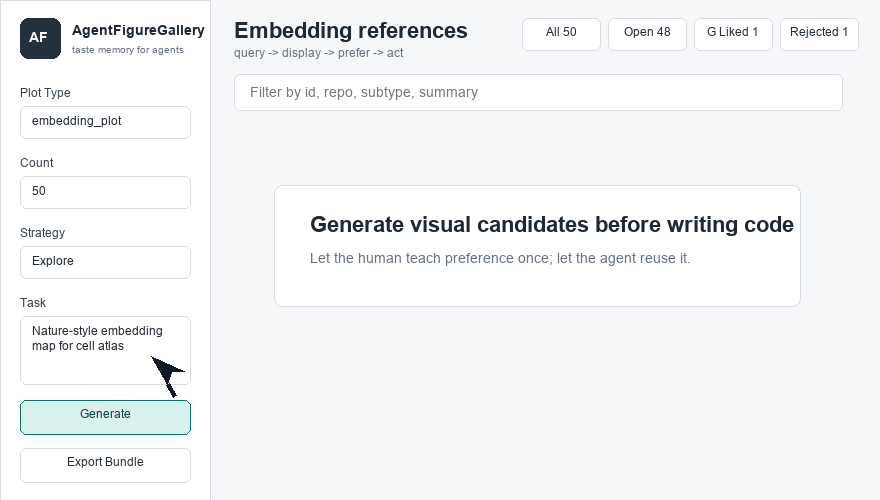

# AgentFigureGallery

[](LICENSE)
[](pyproject.toml)
[](docs/REMOTE_FULL_VALIDATION.md)
[](https://huggingface.co/datasets/dsadd4/AgentFigureGallery)

Make plotting agents learn Nature, Cell, and Science figure taste in one minute.
It turns real visual references plus human like/reject feedback into action-ready plotting guidance for upstream agents.

## Install

```bash
git clone https://github.com/Dsadd4/AgentFigureGallery.git
cd AgentFigureGallery
python -m venv .venv
source .venv/bin/activate
pip install -e .
agentfiguregallery gallery --plot-type embedding_plot --limit 50 --serve
```

## For Agents

After `pip install -e .` finishes, tell your Codex, Claude Code, Cursor, or other coding agent:

```text
Read skills/agent-figure-gallery/SKILL.md, then use AgentFigureGallery before writing publication figure code.
```

See `docs/AGENT_QUICKSTART.md` and `examples/agent_prompt.md`.

Full public KB:

```bash
agentfiguregallery setup --pack full-public --manifest-url https://huggingface.co/datasets/dsadd4/AgentFigureGallery/resolve/main/resource_manifest.json
```

Fallback when Hugging Face is blocked:

```bash
agentfiguregallery setup --pack full-public --manifest manifests/resource_manifest.github-api.json
```

## Dynamic Gallery: Human-Preference Evolution Loop



```text
agent query -> gallery display -> human like/reject/select -> agent action
```

Use the browser gallery to generate candidates by plot type, remove bad references globally, keep type-specific preferences, and export selected references for the agent that will write the final plotting code. Every like/reject becomes reusable taste memory, so the system gets sharper as humans and agents keep using it.

```bash
agentfiguregallery query --task "Nature-style embedding map for cell atlas"
agentfiguregallery gallery --plot-type embedding_plot --limit 100 --serve
```

## What Is Inside

- 16,341 full-public visual candidates across 10 scientific plot types.
- Glike-curated minimal pack committed for instant smoke tests.
- Backend CLI, browser gallery, Codex skill wrapper, and agent expansion guide.
- Candidate IDs, global/type-level preferences, and export bundles for agent handoff.

## Docs

- `ExtendAgent/`: instructions for agents that expand the gallery.
- `docs/AGENT_QUICKSTART.md`: minimal instructions for coding agents.
- `docs/PYPI_RELEASE.md`: Python package release path.
- `docs/HF_DATASET_CARD.md`: Hugging Face dataset card draft.
- `docs/LAUNCH.md`: public launch copy and channels.
- `docs/FULL_KB_DISTRIBUTION.md`: public asset-pack strategy.
- `docs/REMOTE_FULL_VALIDATION.md`: first remote full-public validation and current mirror-speed caveat.
