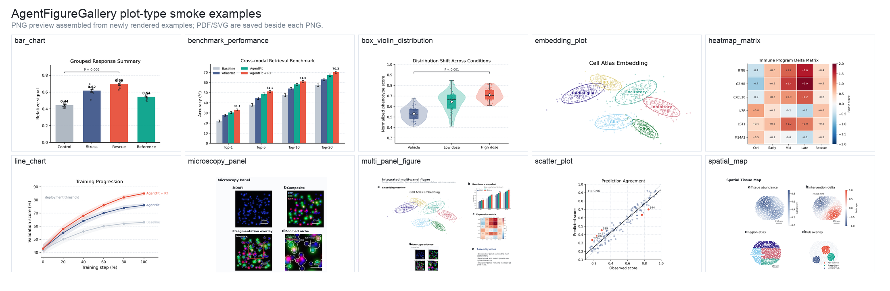

# AgentFigureGallery

[](LICENSE)
[](pyproject.toml)
[](docs/REMOTE_FULL_VALIDATION.md)
[](https://huggingface.co/datasets/dsadd4/AgentFigureGallery)

AgentFigureGallery is a drop-in scientific plotting skill for Claude Code, Codex, Cursor, and other coding agents.
It turns real visual references plus human like/reject feedback into action-ready plotting guidance before code is written.

**One-command bootstrap for Codex:**

```bash
curl -fsSL https://raw.githubusercontent.com/Dsadd4/AgentFigureGallery/main/scripts/install.sh | bash
```

Clone once, run one command, and your coding agent gets a human-curated scientific figure gallery before writing plotting code. Codex, Claude Code, and Cursor-compatible installs are supported.


```text
agent query -> gallery display -> human like/reject/select -> agent action
```

AgentFigureGallery helps coding agents stop guessing what a publication figure should look like. The agent queries visual references first, the human marks taste preferences in a browser gallery, and the selected references are exported as an action bundle before plotting code is written.
With the 16k+ full-public reference pool, that browser gallery becomes a routine taste-tuning loop: launch it often, like/reject/select references, and gradually adapt the skill to your personal or lab-specific figure preferences.

## Codex Skill Smoke Test

After installing the Codex skill, Codex can discover AgentFigureGallery as a local skill.


Then ask your coding agent to run a plot-type smoke test:

```text
Use AgentFigureGallery to test your installed plotting skill. Generate one Nature-style example for each supported plot type, then export PNG/PDF/SVG and a combined preview.
```

The result should look like this: one Nature-style smoke example for every supported plot type.



See `examples/plot_type_examples/` for the runnable script, source data, and PNG/PDF/SVG outputs.

## Install

```bash
git clone https://github.com/Dsadd4/AgentFigureGallery.git
cd AgentFigureGallery
python -m venv .venv
source .venv/bin/activate
pip install -e .
agentfiguregallery doctor
agentfiguregallery install-skill --target codex
```

Launch the browser gallery UI after install to refine your personal gallery:

```bash
agentfiguregallery gallery --plot-type embedding_plot --limit 50 --serve
# Then open http://127.0.0.1:8765/
```

Use it routinely to browse the reference pool and record like/reject/select feedback; those preferences become reusable taste memory for future agent plotting tasks. After your agent expands the gallery, or after you drop new visible references into a local pack, relaunch the gallery and keep refining the same preference memory.

To reopen the frontend later without creating a new reference session:

```bash
agentfiguregallery serve --host 127.0.0.1 --port 8765
```

Install all agent entrypoints:

```bash
curl -fsSL https://raw.githubusercontent.com/Dsadd4/AgentFigureGallery/main/scripts/install.sh | AFG_AGENT_TARGETS="codex claude-code cursor" bash
```

## For Agents

After `pip install -e .` finishes, tell your Codex, Claude Code, Cursor, or other coding agent:

```text
Read skills/agent-figure-gallery/SKILL.md, then use AgentFigureGallery before writing publication figure code.
```

Or install the agent skill wrapper first:

```bash
agentfiguregallery install-skill --target codex
agentfiguregallery install-skill --target claude-code
agentfiguregallery install-skill --target cursor
agentfiguregallery install-cursor-rule --project /path/to/your-cursor-project
```

Codex installs to `~/.codex/skills`, Claude Code installs to `~/.claude/skills`, Cursor-compatible installs to `~/.cursor/skills`, and Cursor Project Rules install to `.cursor/rules/agent-figure-gallery.mdc`. See `docs/AGENT_QUICKSTART.md` and `examples/agent_prompt.md`.

End-to-end examples:

- `examples/end_to_end_embedding.md`
- `examples/generated_embedding_plot/README.md`
- `examples/before_after_benchmark/README.md`

Full public KB:

```bash
agentfiguregallery setup --pack full-public --manifest-url https://huggingface.co/datasets/dsadd4/AgentFigureGallery/resolve/main/resource_manifest.json
```

Fallback when Hugging Face is blocked:

```bash
agentfiguregallery setup --pack full-public --manifest manifests/resource_manifest.github-api.json
```

## Dynamic Gallery

Use the browser gallery to generate candidates by plot type from the 16,341-candidate full-public KB, remove bad references globally, keep type-specific preferences, and export selected references for the agent that will write the final plotting code. Every like/reject becomes reusable taste memory, so the skill gets closer to your visual taste as humans and agents keep using it.

```bash
agentfiguregallery query --task "Nature-style embedding map for cell atlas"
agentfiguregallery gallery --plot-type embedding_plot --limit 100 --serve
```

## Extend Your Gallery

AgentFigureGallery is designed to grow after install. You can ask an agent to follow the expansion contract, or add a small local reference pack yourself, then use the browser gallery to fold the new material into your taste memory.

Tell your coding agent:

```text
Read ExtendAgent/README.md, then expand AgentFigureGallery for <plot type or style>. Discover high-quality public scientific plotting sources, render every useful reference as a visible preview, preserve stable candidate IDs and source license metadata, rebuild the candidate index, and report candidate counts plus private-path scan results.
```

For manual expansion, use the same contract:

1. Add only references that have a visible preview PNG; screenshots or scripts without previews cannot enter the human selection loop.
2. Give every reference a stable `candidate_id`, `plot_type`, preview path, source repository or file metadata, and license/source attribution when available.
3. Keep large preview packs and raw upstream repositories out of Git; publish or store them as packs and update the manifest when they should be shared.
4. Preserve existing preference memory in `data/reference_global_preferences.json` and `outputs/reference_sessions/**/preferences.json`.
5. Refresh the candidate index, run `agentfiguregallery doctor`, then launch `agentfiguregallery gallery --plot-type <plot_type> --limit 50 --serve` to inspect and refine the new candidates.

See `ExtendAgent/README.md` for the maintainer-oriented expansion rules and quality gates.

## What Is Inside

- 16,341 full-public visual candidates across 10 scientific plot types.
- Routine browser-gallery feedback that adapts the skill to personal or lab-specific figure preferences.
- Glike-curated minimal pack committed for instant smoke tests.
- Codex-equipped plot-type smoke examples with PNG/PDF/SVG outputs.
- Backend CLI, browser gallery, Codex skill wrapper, and agent expansion guide.
- Candidate IDs, global/type-level preferences, and export bundles for agent handoff.

## Roadmap

- [Curated Cell and Science style reference packs](https://github.com/Dsadd4/AgentFigureGallery/issues/3)
- [Faster full-public mirror for China and restricted networks](https://github.com/Dsadd4/AgentFigureGallery/issues/4)

Completed proof point:

- [One-command Codex skill install](https://github.com/Dsadd4/AgentFigureGallery/issues/1)
- [Generated embedding plot from a reference bundle](examples/generated_embedding_plot/README.md)
- [Before/after benchmark: prompt-only vs reference-guided plotting](examples/before_after_benchmark/README.md)

## Docs

- `ExtendAgent/`: instructions for agents that expand the gallery.
- `docs/AGENT_QUICKSTART.md`: minimal instructions for coding agents.
- `docs/DISCOVERY_PLAYBOOK.md`: launch and star-growth checklist.
- `docs/releases/v0.1.0.md`: first public release notes.
- `docs/HF_SYNC.md`: Hugging Face dataset card and asset sync commands.
- `docs/PYPI_RELEASE.md`: Python package release path.
- `docs/HF_DATASET_CARD.md`: Hugging Face dataset card draft.
- `docs/LAUNCH.md`: public launch copy and channels.
- `docs/FULL_KB_DISTRIBUTION.md`: public asset-pack strategy.
- `docs/REMOTE_FULL_VALIDATION.md`: first remote full-public validation and current mirror-speed caveat.
