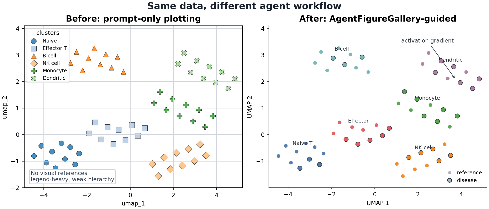

# Before / After Benchmark

This example shows the core claim of AgentFigureGallery with the same tiny synthetic embedding dataset:

```text
before: prompt-only plotting
after: agent query -> visual references -> human preference -> selected bundle -> plotting code
```

Run:

```bash
python examples/before_after_benchmark/render_before_after.py
```

Outputs:

- `examples/before_after_benchmark/figures/before_after_benchmark.png`
- `examples/before_after_benchmark/figures/before_after_benchmark.pdf`
- `examples/before_after_benchmark/figures/before_after_benchmark.svg`

## Preview



## Why This Matters

The left panel represents a typical prompt-only first pass: visible data, but weak hierarchy and no reference taste. The right panel applies the same design logic as `examples/generated_embedding_plot`, using selected references to produce a cleaner publication-style result.
