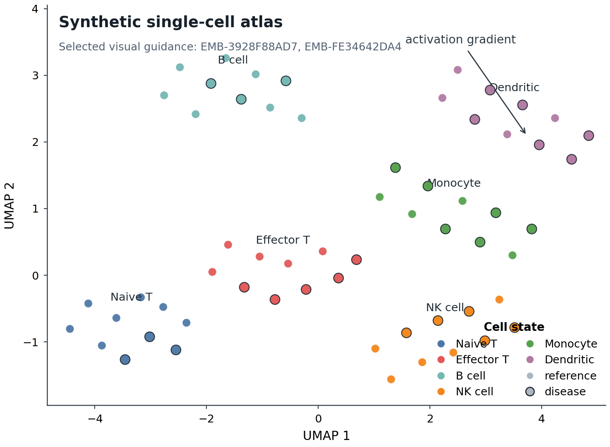

# Generated Embedding Plot Example

This example demonstrates the final step of the AgentFigureGallery loop:

```text
agent query -> gallery display -> human like/reject/select -> export bundle -> plot code
```

The plot is intentionally small and synthetic so it can run from a clean clone. It uses selected embedding references as visual guidance and preserves their candidate IDs in the figure note.

Selected visual guidance from `reference_bundle_example.json`:

- `EMB-3928F88AD7`
- `EMB-FE34642DA4`

## Run

```bash
python examples/generated_embedding_plot/plot_embedding.py
```

Outputs:

- `examples/generated_embedding_plot/figures/embedding_preview.png`
- `examples/generated_embedding_plot/figures/embedding_nature_style.pdf`
- `examples/generated_embedding_plot/figures/embedding_nature_style.svg`

## Preview



## Design Notes

- muted multi-class palette
- light grey background cells with highlighted disease outlines
- direct cell-type labels at cluster centroids
- compact frameless legend
- stable reference IDs retained in the plot annotation

## Agent Handoff

In a real session, `agentfiguregallery bundle --session <session_id>` writes:

```text
outputs/reference_sessions/<session_id>/export_bundle/reference_bundle.json
```

This example keeps a tiny `reference_bundle_example.json` beside the script so the final plot can be regenerated without a live browser session.
